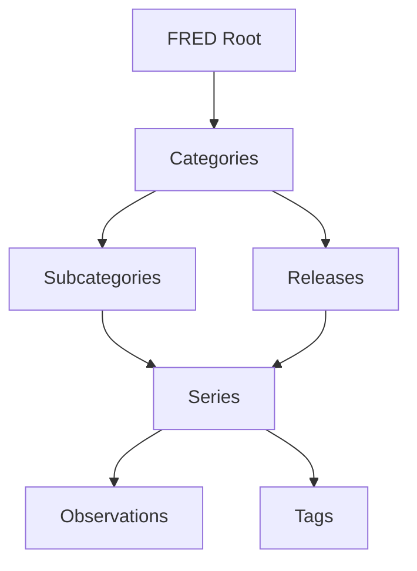

# FRED Data Structure

FRED (Federal Reserve Economic Data) contains over 800,000 economic time series with a well-organized hierarchical structure.

## Data Hierarchy



## Core Entities

### Series

A series is a single economic indicator tracked over time.

<ParamField path="series_id" type="string" required>
  Unique identifier (e.g., "GDP", "UNRATE", "DFF")
</ParamField>

<ParamField path="title" type="string">
  Full descriptive name
</ParamField>

<ParamField path="observation_start" type="date">
  Date of first available data point
</ParamField>

<ParamField path="observation_end" type="date">
  Date of most recent data point
</ParamField>

<ParamField path="frequency" type="string">
  Data collection interval: Daily, Weekly, Monthly, Quarterly, Annual
</ParamField>

<ParamField path="units" type="string">
  Measurement units (Dollars, Percent, Index, etc.)
</ParamField>

<ParamField path="seasonal_adjustment" type="string">
  SA (Seasonally Adjusted), NSA (Not Seasonally Adjusted), SAAR
</ParamField>

<ParamField path="popularity" type="integer">
  Usage ranking from 1-100
</ParamField>

**Example Series:**
```json
{
  "id": "UNRATE",
  "title": "Unemployment Rate",
  "observation_start": "1948-01-01",
  "observation_end": "2024-09-01",
  "frequency": "Monthly",
  "frequency_short": "M",
  "units": "Percent",
  "seasonal_adjustment": "Seasonally Adjusted",
  "popularity": 95,
  "notes": "The unemployment rate represents..."
}
```

### Observations

Individual data points within a series.

```json
{
  "observations": [
    {
      "date": "2024-09-01",
      "value": "4.2",
      "realtime_start": "2024-10-04",
      "realtime_end": "2024-10-04"
    },
    {
      "date": "2024-08-01",
      "value": "4.3",
      "realtime_start": "2024-09-06",
      "realtime_end": "2024-09-06"
    }
  ]
}
```

### Categories

Hierarchical organization of related series.

<CardGroup cols={2}>
  <Card title="Money, Banking & Finance" icon="dollar-sign">
    32991 - Interest rates, exchange rates, monetary aggregates
  </Card>
  <Card title="Population, Employment & Labor" icon="users">
    10 - Demographics, employment, wages
  </Card>
  <Card title="Production & Business Activity" icon="industry">
    1 - GDP, industrial production, capacity utilization
  </Card>
  <Card title="Prices" icon="tag">
    32455 - Inflation, CPI, PPI, import/export prices
  </Card>
  <Card title="International Data" icon="globe">
    32263 - Global economic indicators
  </Card>
  <Card title="U.S. Regional Data" icon="map">
    3008 - State and metro area statistics
  </Card>
</CardGroup>

### Releases

Scheduled data publications from source agencies.

```json
{
  "id": 50,
  "realtime_start": "2024-10-01",
  "realtime_end": "2024-10-01",
  "name": "Employment Situation",
  "press_release": true,
  "link": "https://www.bls.gov/news.release/empsit.htm"
}
```

### Tags

Categorical descriptors for discovery and filtering.

**Tag Categories:**
- **Geographic**: usa, state, nation, county, msa
- **Frequency**: daily, weekly, monthly, quarterly, annual
- **Source**: bls, bea, census, frb, oecd
- **Topic**: employment, gdp, inflation, interest rate
- **Seasonal Adjustment**: sa, nsa, saar

## Data Types

### Economic Indicators

<Tabs>
  <Tab title="Labor Market">
    - Unemployment Rate (UNRATE)
    - Nonfarm Payrolls (PAYEMS)
    - Labor Force Participation (CIVPART)
    - Initial Jobless Claims (ICSA)
    - Average Hourly Earnings (CES0500000003)
  </Tab>

  <Tab title="Production">
    - Gross Domestic Product (GDP)
    - Industrial Production (INDPRO)
    - Capacity Utilization (TCU)
    - Manufacturing Output (IPMAN)
    - Retail Sales (RSXFS)
  </Tab>

  <Tab title="Prices">
    - Consumer Price Index (CPIAUCSL)
    - Core CPI (CPILFESL)
    - Producer Price Index (PPIACO)
    - PCE Price Index (PCEPI)
    - Import Price Index (IR)
  </Tab>

  <Tab title="Financial">
    - Federal Funds Rate (DFF)
    - 10-Year Treasury (DGS10)
    - S&P 500 (SP500)
    - Exchange Rates (DEXUSEU)
    - M2 Money Supply (M2SL)
  </Tab>
</Tabs>

### Frequency Types

| Frequency | Code | Typical Use Cases | Example |
|-----------|------|-------------------|---------|
| Daily | d | Financial markets, rates | Fed Funds Rate |
| Weekly | w | Claims, surveys | Initial Claims |
| Biweekly | bw | Specific surveys | Retail sales surveys |
| Monthly | m | Most indicators | Unemployment, CPI |
| Quarterly | q | GDP, accounts | GDP, Corporate Profits |
| Semiannual | sa | Some surveys | Business outlook |
| Annual | a | Demographics, some surveys | Population |

### Units and Scaling

<Warning>
  **Critical: Always check units and scaling**

  Values may be expressed as:
  - Raw numbers (e.g., persons employed)
  - Thousands or millions (e.g., GDP in billions)
  - Index values (e.g., CPI with base year)
  - Percentages (e.g., unemployment rate)
  - Rates (e.g., annual rate)
</Warning>

Common unit types:
```json
{
  "units": "Billions of Dollars",
  "units": "Percent",
  "units": "Index 1982-1984=100",
  "units": "Thousands of Persons",
  "units": "Index 2012=100",
  "units": "Millions of Dollars"
}
```

## Data Transformations

### Available Transformations

| Transformation | Code | Formula | Use Case |
|----------------|------|---------|----------|
| Levels | lin | Raw value | Actual amounts |
| Change | chg | x_t - x_{t-1} | Period-to-period change |
| Change from Year Ago | ch1 | x_t - x_{t-n} | Annual change |
| Percent Change | pch | ((x_t/x_{t-1})-1)*100 | Growth rates |
| Percent Change from Year Ago | pc1 | ((x_t/x_{t-n})-1)*100 | Annual growth |
| Compounded Annual Rate | pca | (((x_t/x_{t-1})^(n))-1)*100 | Annualized growth |
| Continuously Compounded Rate | cch | (ln(x_t)-ln(x_{t-1}))*100 | Log returns |
| Continuously Compounded Annual | cca | (ln(x_t)-ln(x_{t-n}))*100 | Log annual returns |
| Natural Log | log | ln(x_t) | Statistical analysis |

### Aggregation Methods

When converting frequency:

| Method | Description | Best For |
|--------|-------------|----------|
| Average | Mean of period | Flow variables (rates, prices) |
| Sum | Total of period | Stock variables (production, sales) |
| End of Period | Last value | Levels, indices |

## Data Quality

### Revisions

Economic data undergoes revisions:

<Steps>
  <Step title="Preliminary Release">
    Initial estimate based on partial data
  </Step>

  <Step title="Revised Release">
    Updated with more complete information
  </Step>

  <Step title="Final Release">
    Comprehensive data, may come months later
  </Step>

  <Step title="Annual Revisions">
    Methodological updates and rebasing
  </Step>
</Steps>

### Vintage Data

FRED maintains historical snapshots:

```json
{
  "realtime_start": "2024-01-05",
  "realtime_end": "2024-01-05",
  "observation_start": "2023-12-01",
  "observation_end": "2023-12-01",
  "vintage_dates": [
    "2024-01-05",
    "2023-12-08",
    "2023-11-03"
  ]
}
```

This allows analysis of:
- Data as it was known at specific dates
- Magnitude of revisions
- Forecasting accuracy

### Missing Values

Series may have gaps:

- Discontinued series
- Weekends/holidays (daily data)
- Not-yet-released observations
- Suppressed values (privacy/reliability)

Represented as:
```json
{
  "date": "2024-01-01",
  "value": "."
}
```

## Search and Discovery

### Full-Text Search

Search across:
- Series titles
- Series descriptions
- Category names
- Tag names
- Release names

**Example:**
```
"unemployment" → Returns ~500 series
"unemployment rate seasonally adjusted" → ~50 series
"UNRATE" → Exact match
```

### Tag-Based Filtering

Combine multiple tags:
```
tags: ["monthly", "sa", "bls", "employment"]
```

### Category Browsing

Navigate hierarchy:
```
Root (0)
  └─ Population, Employment & Labor Markets (10)
      └─ Current Employment Statistics (11)
          └─ [~500 series]
```

## Common Series

### Key Economic Indicators

<AccordionGroup>
  <Accordion title="Labor Market (Monthly)">
    - **UNRATE**: Unemployment Rate (SA)
    - **PAYEMS**: Total Nonfarm Payrolls (SA)
    - **CIVPART**: Labor Force Participation Rate (SA)
    - **U6RATE**: Total Unemployed + Marginally Attached (SA)
  </Accordion>

  <Accordion title="GDP & Production (Quarterly)">
    - **GDP**: Gross Domestic Product (SAAR)
    - **GDPC1**: Real GDP (SAAR)
    - **INDPRO**: Industrial Production Index (SA)
    - **TCU**: Capacity Utilization (SA)
  </Accordion>

  <Accordion title="Inflation (Monthly)">
    - **CPIAUCSL**: CPI All Items (SA)
    - **CPILFESL**: CPI Less Food & Energy (SA)
    - **PCEPI**: PCE Price Index (SA)
    - **PCEPILFE**: Core PCE Price Index (SA)
  </Accordion>

  <Accordion title="Interest Rates (Daily)">
    - **DFF**: Federal Funds Effective Rate
    - **DGS10**: 10-Year Treasury Constant Maturity
    - **DGS2**: 2-Year Treasury Constant Maturity
    - **T10Y2Y**: 10-Year minus 2-Year Treasury Spread
  </Accordion>
</AccordionGroup>

## API Response Format

### Series Metadata

```json
{
  "seriess": [{
    "id": "GDP",
    "realtime_start": "2024-10-01",
    "realtime_end": "2024-10-01",
    "title": "Gross Domestic Product",
    "observation_start": "1947-01-01",
    "observation_end": "2024-04-01",
    "frequency": "Quarterly",
    "frequency_short": "Q",
    "units": "Billions of Dollars",
    "units_short": "Bil. of $",
    "seasonal_adjustment": "Seasonally Adjusted Annual Rate",
    "seasonal_adjustment_short": "SAAR",
    "last_updated": "2024-09-26 07:46:02-05",
    "popularity": 92,
    "notes": "BEA Account Code: A191RC..."
  }]
}
```

### Observations Data

```json
{
  "realtime_start": "2024-10-01",
  "realtime_end": "2024-10-01",
  "observation_start": "2020-01-01",
  "observation_end": "2024-04-01",
  "units": "lin",
  "output_type": 1,
  "file_type": "json",
  "order_by": "observation_date",
  "sort_order": "asc",
  "count": 18,
  "offset": 0,
  "limit": 100000,
  "observations": [...]
}
```

## Next Steps

<CardGroup cols={2}>
  <Card
    title="API Tools"
    icon="wrench"
    href="/api-reference/overview"
  >
    Use data retrieval tools
  </Card>
  <Card
    title="Examples"
    icon="code"
    href="/examples/basic-usage"
  >
    See practical examples
  </Card>
  <Card
    title="Common Series"
    icon="chart-line"
    href="/resources/common-series"
  >
    Popular indicators
  </Card>
  <Card
    title="Transformations"
    icon="calculator"
    href="/resources/data-transformations"
  >
    Data transformation guide
  </Card>
</CardGroup>
