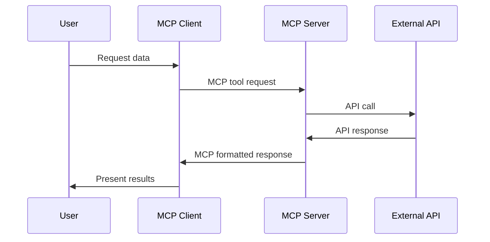
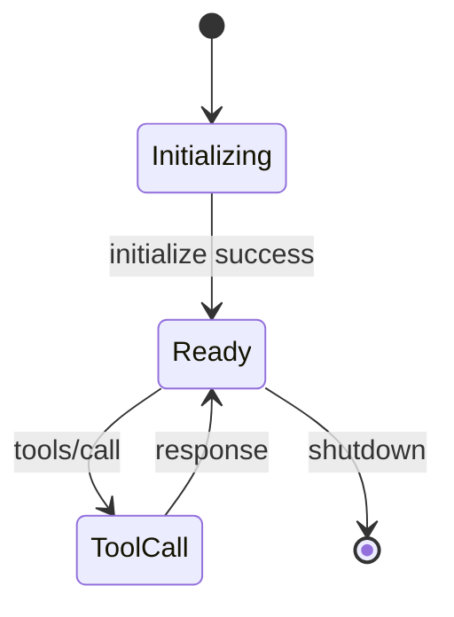

# Model Context Protocol (MCP)

The Model Context Protocol is an open standard that enables AI assistants to securely connect to external data sources and tools.

## Protocol Overview

MCP provides a standardized way for AI assistants to:

<CardGroup cols={2}>
  <Card title="Access Tools" icon="wrench">
    Execute functions and retrieve data from external systems
  </Card>
  <Card title="Exchange Data" icon="arrow-right-arrow-left">
    Send structured requests and receive formatted responses
  </Card>
  <Card title="Maintain Context" icon="brain">
    Preserve conversation state and execution history
  </Card>
  <Card title="Ensure Security" icon="shield">
    Control access and validate requests
  </Card>
</CardGroup>

## Architecture

### Communication Flow



### Components

#### MCP Client

The client runs within the AI assistant environment:

- Handles user interactions
- Formats tool requests according to MCP spec
- Parses server responses
- Manages connection lifecycle

#### MCP Server

The server bridges AI assistants and external services:

- Exposes available tools and capabilities
- Validates incoming requests
- Transforms requests to API calls
- Formats responses for AI consumption
- Handles errors and retries

## Protocol Features

### Tool Discovery

Servers advertise their capabilities:

```json
{
  "tools": [
    {
      "name": "fred_search",
      "description": "Search FRED economic data series",
      "inputSchema": {
        "type": "object",
        "properties": {
          "query": {
            "type": "string",
            "description": "Search terms"
          }
        },
        "required": ["query"]
      }
    }
  ]
}
```

### Request Format

Tool calls follow a standardized structure:

```json
{
  "method": "tools/call",
  "params": {
    "name": "fred_search",
    "arguments": {
      "query": "unemployment rate",
      "limit": 10
    }
  }
}
```

### Response Format

Servers return structured data:

```json
{
  "content": [
    {
      "type": "text",
      "text": "Found 10 series matching query"
    },
    {
      "type": "resource",
      "resource": {
        "uri": "fred://series/UNRATE",
        "name": "Unemployment Rate",
        "mimeType": "application/json"
      }
    }
  ]
}
```

## Connection Types

### Standard I/O (stdio)

Direct process communication:

- Server runs as subprocess
- Uses stdin/stdout for messaging
- Lowest latency
- Most secure (no network exposure)

**Configuration:**
```json
{
  "mcpServers": {
    "fred": {
      "command": "npx",
      "args": ["-y", "fred-mcp-server"],
      "env": {
        "FRED_API_KEY": "your-api-key"
      }
    }
  }
}
```

### HTTP/SSE

Network-based communication:

- Server runs as web service
- Uses Server-Sent Events for streaming
- Supports remote deployment
- Requires network configuration

## Security Model

### Authentication

<AccordionGroup>
  <Accordion title="API Key Management">
    - Keys stored in environment variables
    - Never exposed in requests/responses
    - Can be rotated without code changes
  </Accordion>

  <Accordion title="Request Validation">
    - Schema validation on all inputs
    - Type checking and sanitization
    - Rate limiting enforcement
  </Accordion>

  <Accordion title="Sandboxing">
    - Server runs in isolated process
    - Limited filesystem access
    - Network access controlled
  </Accordion>
</AccordionGroup>

### Data Privacy

MCP ensures:

- No data logged without consent
- Responses contain only requested data
- Secure transmission between components
- API keys never appear in responses

## Error Handling

### Error Types

| Code | Type | Description |
|------|------|-------------|
| -32700 | Parse Error | Invalid JSON received |
| -32600 | Invalid Request | Malformed request structure |
| -32601 | Method Not Found | Unknown tool requested |
| -32602 | Invalid Params | Bad parameter values |
| -32603 | Internal Error | Server-side failure |

### Error Response Format

```json
{
  "error": {
    "code": -32602,
    "message": "Invalid params",
    "data": {
      "field": "query",
      "reason": "Required parameter missing"
    }
  }
}
```

## Performance Considerations

### Request Optimization

<Steps>
  <Step title="Batch Related Calls">
    Group similar requests when possible
  </Step>

  <Step title="Use Streaming">
    For large datasets, stream results incrementally
  </Step>

  <Step title="Limit Data Requests">
    Request only necessary date ranges and series
  </Step>

  <Step title="Implement Timeouts">
    Set reasonable limits for long-running operations
  </Step>
</Steps>

### Connection Management

- Reuse server processes
- Implement connection pooling
- Handle graceful shutdowns
- Monitor resource usage

## MCP Specification

The protocol follows JSON-RPC 2.0 with extensions:

### Core Methods

| Method | Purpose |
|--------|---------|
| `initialize` | Establish connection |
| `tools/list` | Discover available tools |
| `tools/call` | Execute tool |
| `resources/list` | List available resources |
| `resources/read` | Access resource content |
| `prompts/list` | Get prompt templates |

### Lifecycle



## Best Practices

### Server Development

<Tip>
  **Key principles:**
  - Implement comprehensive error handling
  - Validate all inputs thoroughly
  - Provide clear, descriptive tool schemas
  - Return actionable error messages
  - Log appropriately for debugging
</Tip>

### Client Integration

<Warning>
  **Common pitfalls:**
  - Not handling connection failures
  - Ignoring timeout scenarios
  - Poor error message presentation
  - Inadequate retry logic
</Warning>

## FRED MCP Implementation

This server implements MCP to provide:

### Tools

1. **fred_search**: Full-text search across all series
2. **fred_browse**: Navigate category hierarchy
3. **fred_get_series**: Retrieve time series data

### Resources

- Series metadata
- Category information
- Release schedules

### Prompts

- Economic analysis templates
- Data exploration guides
- Research question frameworks

## Next Steps

<CardGroup cols={2}>
  <Card
    title="API Tools"
    icon="wrench"
    href="/api-reference/overview"
  >
    Explore available tools
  </Card>
  <Card
    title="FRED Data"
    icon="database"
    href="/core-concepts/fred-data"
  >
    Understand data structure
  </Card>
  <Card
    title="Authentication"
    icon="key"
    href="/core-concepts/authentication"
  >
    Setup API access
  </Card>
  <Card
    title="Examples"
    icon="code"
    href="/examples/basic-usage"
  >
    See usage examples
  </Card>
</CardGroup>
