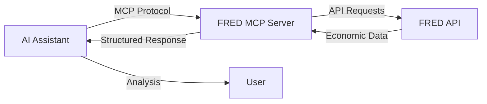

# Core Concepts

Understanding the fundamental concepts behind the FRED MCP Server will help you use it effectively.

## What is FRED?

**FRED (Federal Reserve Economic Data)** is a comprehensive database maintained by the Federal Reserve Bank of St. Louis containing over 800,000 economic time series from 100+ sources.

### Key Features

<CardGroup cols={2}>
  <Card title="Comprehensive Coverage" icon="globe">
    Data from U.S. government agencies, international organizations, and academic sources
  </Card>
  <Card title="Historical Depth" icon="clock-rotate-left">
    Some series dating back to the 1800s, providing long-term economic perspective
  </Card>
  <Card title="Real-Time Updates" icon="arrows-rotate">
    Data updated as soon as released by source agencies
  </Card>
  <Card title="Free Access" icon="unlock">
    All data freely available with API key registration
  </Card>
</CardGroup>

## What is MCP?

**Model Context Protocol (MCP)** is an open standard for connecting AI assistants to external data sources and tools.

### MCP Benefits

- **Standardized Interface**: Consistent way to access external tools
- **Security**: Controlled access to resources
- **Flexibility**: Works with any MCP-compatible client
- **Extensibility**: Easy to add new capabilities

## How FRED MCP Server Works



### Architecture Components

1. **MCP Client** (e.g., Claude Desktop)
   - Sends tool requests
   - Receives structured data
   - Presents results to user

2. **FRED MCP Server**
   - Translates MCP requests to FRED API calls
   - Handles authentication
   - Processes and formats responses
   - Manages rate limiting

3. **FRED API**
   - Official Federal Reserve data source
   - RESTful API endpoints
   - JSON/XML responses

## Data Organization

### Series Structure

Each FRED series has:

<ParamField path="Series ID" type="string">
  Unique identifier (e.g., "GDP", "UNRATE")
</ParamField>

<ParamField path="Title" type="string">
  Descriptive name
</ParamField>

<ParamField path="Frequency" type="string">
  Data interval (daily, weekly, monthly, quarterly, annual)
</ParamField>

<ParamField path="Units" type="string">
  Measurement units (percent, billions of dollars, index)
</ParamField>

<ParamField path="Seasonal Adjustment" type="string">
  Whether data is seasonally adjusted
</ParamField>

<ParamField path="Observations" type="array">
  Time series data points with dates and values
</ParamField>

### Category Hierarchy

FRED organizes data in a hierarchical category structure:

```
Root Categories
├── Money, Banking & Finance
│   ├── Interest Rates
│   ├── Exchange Rates
│   └── Banking
├── Population, Employment & Labor Markets
│   ├── Unemployment Rate
│   ├── Employment
│   └── Labor Force
└── Production & Business Activity
    ├── GDP
    ├── Industrial Production
    └── Business Surveys
```

### Data Sources

Major data providers include:

- **U.S. Government Agencies**
  - Bureau of Labor Statistics (BLS)
  - Bureau of Economic Analysis (BEA)
  - Census Bureau
  - Federal Reserve Board

- **International Organizations**
  - World Bank
  - OECD
  - IMF
  - Bank for International Settlements

- **Academic Institutions**
  - University research centers
  - Economic research organizations

## Time Series Concepts

### Frequency

Data collection intervals:

| Frequency | Code | Example Series |
|-----------|------|----------------|
| Daily | d | DFF (Fed Funds Rate) |
| Weekly | w | ICSA (Initial Claims) |
| Monthly | m | UNRATE (Unemployment) |
| Quarterly | q | GDP (Gross Domestic Product) |
| Annual | a | POPTHM (Population) |

### Seasonal Adjustment

Many economic series show seasonal patterns:

- **SA (Seasonally Adjusted)**: Seasonal effects removed
- **NSA (Not Seasonally Adjusted)**: Raw data with seasonal patterns
- **SAAR (Seasonally Adjusted Annual Rate)**: Adjusted and annualized

### Transformations

Mathematical operations on data:

| Transform | Code | Description | Use Case |
|-----------|------|-------------|----------|
| Levels | lin | Raw values | Actual amounts |
| Change | chg | Difference from previous | Absolute changes |
| Percent Change | pch | % change from previous | Growth rates |
| Year-over-Year | pc1 | % change from year ago | Annual comparisons |
| Log | log | Natural logarithm | Statistical analysis |

## Data Quality

### Vintage Data

FRED maintains historical versions of data:

- **Real-time data**: Current values
- **Vintage data**: Values as they existed on specific dates
- **Revisions**: Updates to previously released data

### Data Updates

Update patterns vary by series:

- **High-frequency**: Updated daily or weekly
- **Monthly indicators**: Released on schedule (e.g., first Friday)
- **Quarterly data**: Released with lag (e.g., GDP one month after quarter end)
- **Annual series**: Updated yearly

### Missing Data

Handling gaps in series:

- Some series have incomplete histories
- Holidays and weekends create gaps in daily data
- Series may be discontinued or replaced

## API Concepts

### Rate Limiting

FRED API has usage limits:

- **120 requests/minute**: General limit
- **40 requests/minute**: For series observations
- **Daily limit**: Varies by API key tier

The MCP server handles this automatically with:
- Request queuing
- Exponential backoff
- Retry logic

### Pagination

Large result sets use pagination:

```json
{
  "limit": 100,    // Items per page
  "offset": 200,   // Skip first 200 items
  "total": 1500    // Total available items
}
```

### Error Handling

Common error types:

| Code | Meaning | Resolution |
|------|---------|------------|
| 400 | Bad Request | Check parameters |
| 401 | Unauthorized | Verify API key |
| 404 | Not Found | Check series ID |
| 429 | Rate Limited | Wait and retry |
| 500 | Server Error | Retry later |

## Search and Discovery

### Search Methods

1. **Text Search**: Find series by keywords
2. **Tag Search**: Filter by categories and attributes
3. **Browse**: Navigate category hierarchy
4. **Release-based**: Find series by data release

### Tag System

Tags categorize and describe series:

- **Geographic**: usa, state, county, msa
- **Frequency**: daily, weekly, monthly
- **Topic**: gdp, inflation, employment
- **Source**: bls, bea, federal reserve

### Popularity Ranking

FRED tracks series popularity:
- Based on access frequency
- Helps identify commonly-used indicators
- Range from 1-100

## Best Practices

### Efficient Queries

<Steps>
  <Step title="Use Specific IDs">
    When you know the series ID, use it directly
  </Step>

  <Step title="Limit Date Ranges">
    Request only the time period you need
  </Step>

  <Step title="Plan Queries Carefully">
    Think through data needs to avoid redundant requests
  </Step>

  <Step title="Batch Related Requests">
    Group similar queries to minimize API calls
  </Step>
</Steps>

### Data Interpretation

<Warning>
  **Important considerations:**
  - Check units and scaling (millions vs billions)
  - Verify seasonal adjustment status
  - Note data frequency and aggregation
  - Consider revision history for critical analysis
</Warning>

## Common Patterns

### Economic Analysis Pattern

1. **Discover** relevant series using search/browse
2. **Retrieve** data with appropriate transformations
3. **Compare** across time periods or series
4. **Analyze** trends and relationships

### Monitoring Pattern

1. **Identify** key indicators to track
2. **Schedule** regular data retrieval
3. **Alert** on significant changes
4. **Report** findings

### Research Pattern

1. **Browse** categories for comprehensive coverage
2. **Search** for specific relationships
3. **Retrieve** long historical periods
4. **Transform** for statistical analysis

## Next Steps

<CardGroup cols={2}>
  <Card
    title="MCP Protocol"
    icon="plug"
    href="/core-concepts/mcp-protocol"
  >
    Learn about MCP architecture
  </Card>
  <Card
    title="FRED Data"
    icon="database"
    href="/core-concepts/fred-data"
  >
    Explore FRED data structure
  </Card>
  <Card
    title="Authentication"
    icon="key"
    href="/core-concepts/authentication"
  >
    API key and security
  </Card>
  <Card
    title="API Reference"
    icon="code"
    href="/api-reference/overview"
  >
    Tool documentation
  </Card>
</CardGroup>